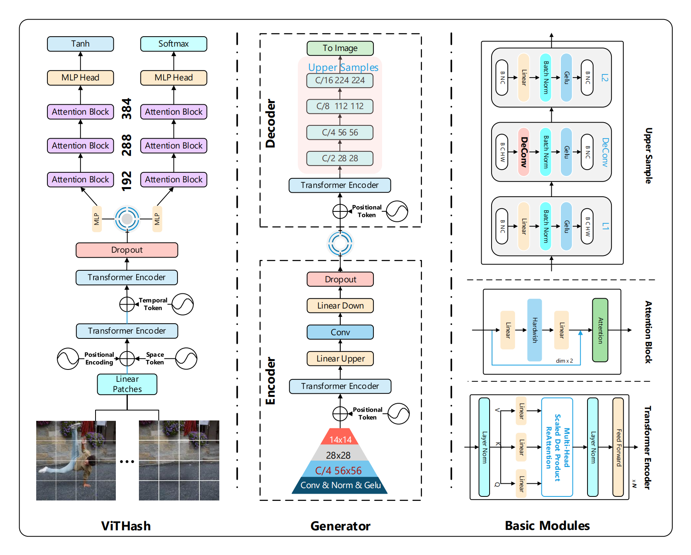

<h1 align="center">
  VTL
</h1>

<div align="center">
Fake Video Tracing the Source and Localization Based on Vision Transformer
</div>

## 📜 Directory
 
- [Introduction](#-introduction)
  - [DAVIS2016-TL](#davis2016-tl)
  - [DFTL](#dftl)
  - [Trace Samples and Acc of HashBits](#trace-samples-and-acc-of-hashbits)
  - [DFTL Dataset Samples](#dftl-dataset-samples)
  - [DAVIS2016-TL Dataset Samples](#davis2016-tl-dataset-samples)
- [Train or Test](#-train-or-test)
  - [Datasets Download](#datasets-download)
  - [Train ViTHash](#train-vithash)
  - [Train Generator](#train-generator)
  - [Test IOU](#test-iou)
  - [Test ViTHash](#test-vithash)
  - [Test CSQ](#test-csq)
- [Tracing](#%EF%B8%8F-tracing)
  - [Trace Samples](#trace-samples)
- [Localization](#%EF%B8%8F-localization)
  - [Localization Samples](#localization-samples)
  
## ✨ Introduction

Traditional fake video detect methods usually take advantage of high performance, which are output a possibility value
or mask. However, the results of this possibility cannot be used as convincing evidence. We propose a solution namely
Video Tracing and Localization (VTL) to solve the above problems. The VTL finding the original video and comparing with
it. On the first stage, we generate a hash code through ViTHash (VTL-T). Then, using the hash code to retrieve the
original video. On the second stage, the original video and fake video input to generator (VTL-L), and the suspect
regions are masked to provide auxiliary information. Specifically, compared with traditional video retrieval, it is a
challenge to find the real one from similar source videos. We design a novel loss Hash Triplet Loss to solve that the
videos of persons are very similar: same scene with different angles, similar scenes with same people. Moreover, we
contribute two datasets: DFTL and DAVIS2016-TL. As a result, the VTL achieved comparable performance with
stat-of-the-art methods on the DAVIS2016-TL, and have a huge advantage on the DFTL. In this paper, we mainly focus on
the video retrieval used in the fake video detection.

<div align="center">
    
</div>

### Trace Samples and Acc of HashBits

<div align="center">
    
    
</div>

### DFTL Dataset Samples

<div style="align-items: center;text-align: center; display: inline-block" >
    <div>
        <h3 align="center"><a href="assets/source.mp4">Source Videos</a></h3>
        <div  align="center">
            
            
            
        </div>
    </div>
    <div>
        <h3 align="center"><a href="assets/girl.mp4">Fake Video</a></h3>
        <div  align="center">
            
            
            
        </div>
    </div>  
</div>

### DAVIS2016-TL Dataset Samples

<div style="align-items: center;text-align: center; display: inline-block" >
    <div>
        <div  align="center">
            
            
            
        </div>
    </div>
    <div>
        <div  align="center">
            
            
            
        </div>
    </div>  
</div>

## 🔬 Train or Test

### Datasets Download

[BaiduNetdisk](https://pan.baidu.com/s/1PPlDaB4qH2hcU9TQY_KGdA) code：VTLs

* actors: Source videos and fake videos of 16minutes
* DFTL: Dataset of DFTL
* DAVIS2016-TL: Extension of [DAVIS2016](https://davischallenge.org/)

Extract to the same directory as the code.

Example:

* vtl: our code
* vrf: dataset of DFTL
* inpainting: dataset of DAVIS2016-TL

### Train ViTHash

* local_rank: gpu id
* path: dataset path
* type: choice dataloader
  * 0: DFTL dataloader, dir name is **vrf**
  * 1: DAVIS2016-TL dataloader, dir name is **inpainting**

```apache
python train_h.py --local_rank=0 --path=../vrf --type=0 --bits=128
```

### Train Generator

* local_rank: gpu id
* path: dataset path
* type: choice dataloader
  * 0: DFTL dataloader, dir name is **vrf**
  * 1: DAVIS2016-TL dataloader, dir name is **inpainting**

```apache
python train_g.py --local_rank=0 --path=../vrf --type=0
```

### Test IOU

The test script will test Generator of VTL and DMAC together on DFTL and DAVIS2016-TL.
You can modify it for yourself.

```apache
python test_iou.py
```

### Test ViTHash

1. type: choice dataloader
   * 0: DFTL dataloader, dir name is **vrf**
   * 1: DAVIS2016-TL dataloader, dir name is **inpainting**
2. path: dataset path
3. hashbits: 128 256 512 or 1024, will load different pre-trained model and hash JSON file.

```apache
python test.py 1 ../inpainting 512
```

### Test CSQ

1. cd ./CSQ
2. run test script

```apache
python hash_test_vrf.py --dataset=Inpainting --pretrained_3d=./Inpainting_64bits.pth
```

## 🚀️ Tracing

### Trace Samples

<div align="center">
    
    
    
</div>

## 👀️ Localization

### Localization Samples

<div align="center">
<h3>DAVIS2016-TL</h3>
<div>
    
    
</div>
</div>
<div align="center">
<h3>DFTL</h3>
<div  align="center">
    
    
</div>
</div>
