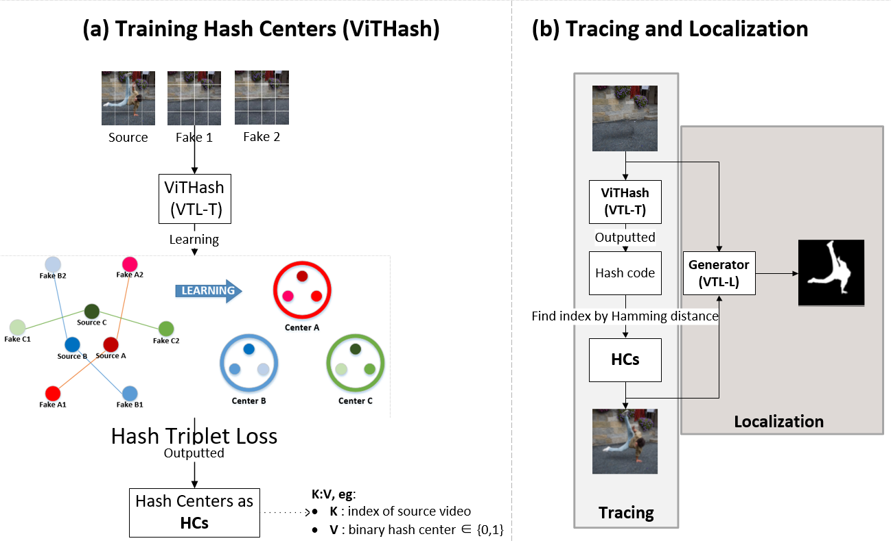
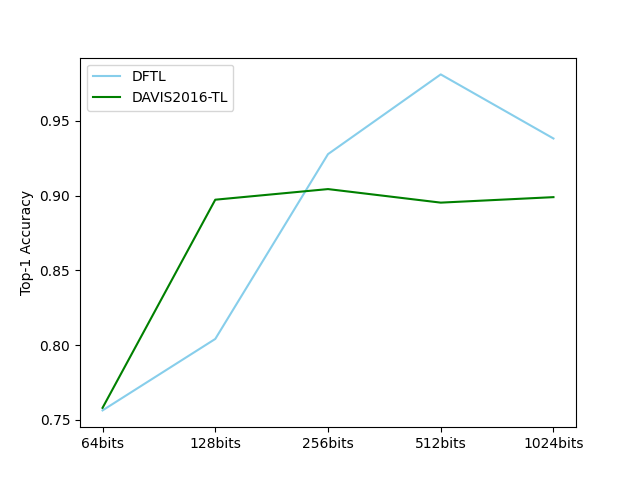
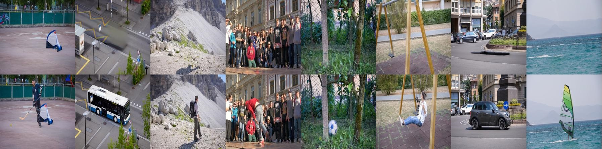
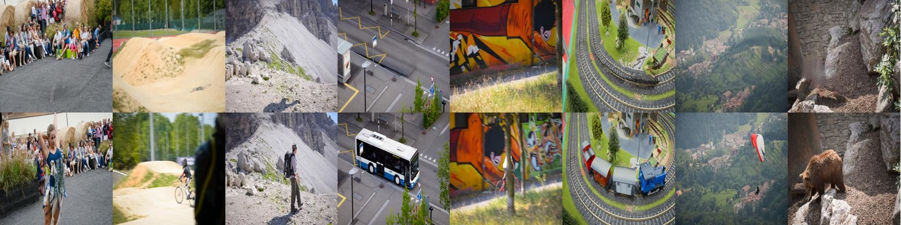
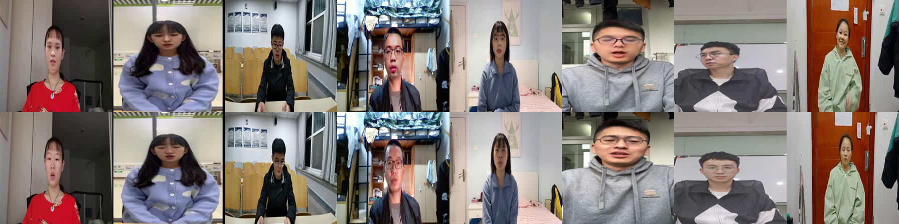
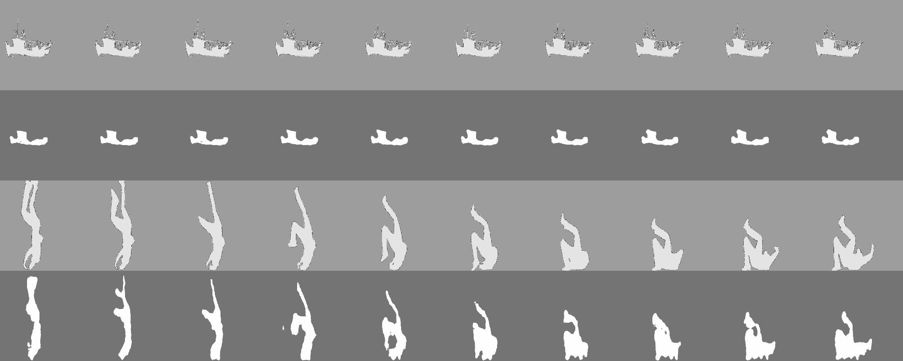
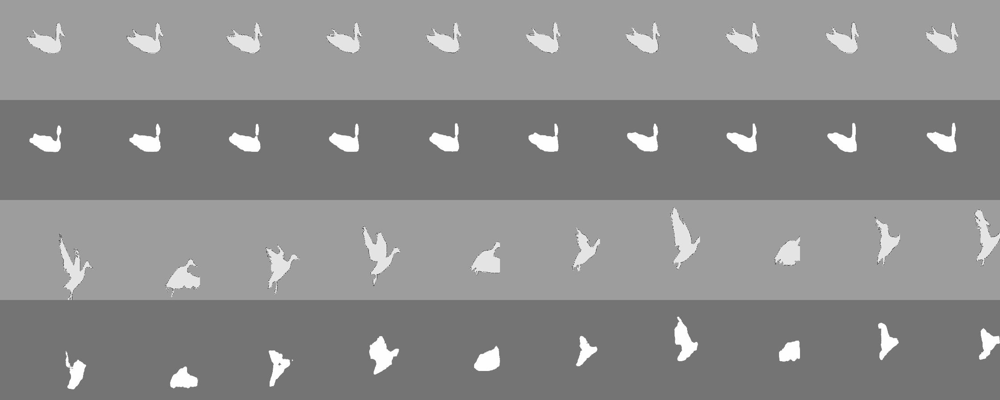
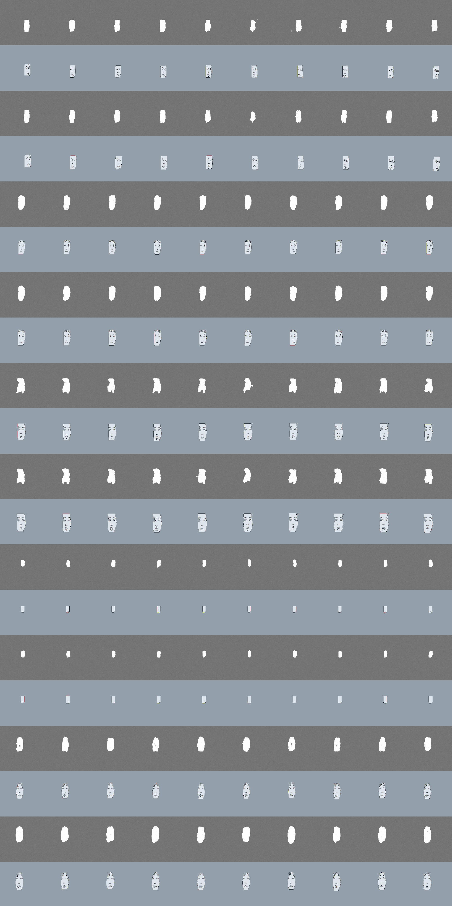

<h1 align="center">
Vision Transformer Based Video Hashing Retrieval for Tracing the Source of Fake Videos🎉️
</h1>

## 📜 Directory

- [Introduction](#-introduction)
  - [VTL](#vtl)
  - [Trace Samples and Acc of HashBits](#trace-samples-and-acc-of-hashbits)
  - [DFTL Dataset Samples](#dftl-dataset-samples)
  - [DAVIS2016-TL Dataset Samples](#davis2016-tl-dataset-samples)
- [Train or Test](#-train-or-test)
  - [Datasets](#datasets)
  - [Train ViTHash](#train-vithash)
  - [Train Generator](#train-generator)
  - [Test IOU](#test-iou)
  - [Test ViTHash](#test-vithash)
  - [Test CSQ](#test-csq)
- [Tracing](#%EF%B8%8F-tracing)
  - [Trace Samples](#trace-samples)
- [Localization](#%EF%B8%8F-localization)
  - [Localization Samples](#localization-samples)

## ✨ Introduction

### VTL

> Video Tracing and Tampering Localization (VTL). A novel framework to detect fake video **(clipping, cropping, blur, etc.)** by tracing the source video of fake video. 1) Training hash centers as HCs. 2) Finding index of source video from HCs. 3) Masking the different between fake video and source video as a result of comparison **(auxiliary information)**.

<div align="center">
    
</div>

### Trace Samples and Acc of HashBits

<div align="center">
    
    
</div>

### DFTL Dataset Samples

> Same person with different scenes. You can download full 16 minutes videos of source video and fake video by follows link.

<div style="align-items: center;text-align: center; display: inline-block" >
    <div>
        <h3 align="center"><a href="assets/source.mp4">Source Videos</a></h3>
        <div  align="center">
            
            
            
        </div>
    </div>
    <div>
        <h3 align="center"><a href="assets/girl.mp4">Fake Videos</a></h3>
        <div  align="center">
            
            
            
        </div>
    </div>  
</div>

> Different fake videos from same source.

<div style="align-items: center;text-align: center; display: inline-block" >
    <div>
        <h3 align="center">Source Video</h3>
        <div  align="center">
            
        </div>
    </div>
    <div>
        <h3 align="center">Fake Videos of Different Face Swap Methods</h3>
        <div  align="center">
            
            
            
        </div>
    </div>  
</div>

### DAVIS2016-TL Dataset Samples

> The first gif of boat is source video, and remaining five videos generated by different inpainting methods.

<div align="center" >
    <div>
        <div  align="center">
            
            
            
        </div>
    </div>
    <div>
        <div  align="center">
            
            
            
        </div>
    </div>  
</div>

## 🔬 Train or Test

### Datasets

**Download**  [BaiduNetdisk](https://pan.baidu.com/s/1PPlDaB4qH2hcU9TQY_KGdA) code：VTLs

* actors: Source videos and fake videos of 16minutes
* DFTL: Dataset of DFTL
* DAVIS2016-TL: Extension of [DAVIS2016](https://davischallenge.org/)

Extract to the same directory of our code (vtl).

Example:

* vtl: our code
* vrf: dataset of DFTL
* inpainting: dataset of DAVIS2016-TL

### Train

**Pretrained models and hash centers**

> pip install -r requirements.txt


| Model     | DFTL                               | DAVIS2016-TL                         |
| ----------- | ------------------------------------ | -------------------------------------- |
| ViTHash   | [64-1024bits](./model/deepfake)    | [64-1024bits](./model/inpainting)    |
| Generator | [link](./model/deepfake/net_g.pth) | [link](./model/inpainting/net_g.pth) |

**Parameters**

* local_rank: gpu id
* path: dataset path
* type: choice dataloader
  * 0: DFTL dataloader, dir name is **vrf**
  * 1: DAVIS2016-TL dataloader, dir name is **inpainting**

**Train ViTHash**

```apache
python train_h.py --local_rank=0 --path=../vrf --type=0 --bits=128
```

**Train Generator**

```apache
python train_g.py --local_rank=0 --path=../vrf --type=0
```

### Test

**Test IOU**

The test script will test Generator of VTL and DMAC together on DFTL and DAVIS2016-TL.
You can modify it for yourself.

```apache
python test_iou.py
```

**Test ViTHash**

1. type: choice dataloader
   * 0: DFTL dataloader, dir name is **vrf**
   * 1: DAVIS2016-TL dataloader, dir name is **inpainting**
2. path: dataset path
3. hashbits: 128 256 512 or 1024, will load different pre-trained model and hash JSON file.

```apache
python test.py 1 ../inpainting 512
```

**Test CSQ**

1. cd ./CSQ
2. run test script

```apache
python hash_test_vrf.py --dataset=Inpainting --pretrained_3d=./Inpainting_64bits.pth
```

## 🚀️ Tracing

### Trace Samples

<div align="center">
    
    
    
</div>

## 👀️ Localization

### Localization Samples

<div align="center">
<h3>DAVIS2016-TL</h3>
<div>
    
    
</div>
</div>
<div align="center">
<h3>DFTL</h3>
<div  align="center">
    
    
</div>
</div>
