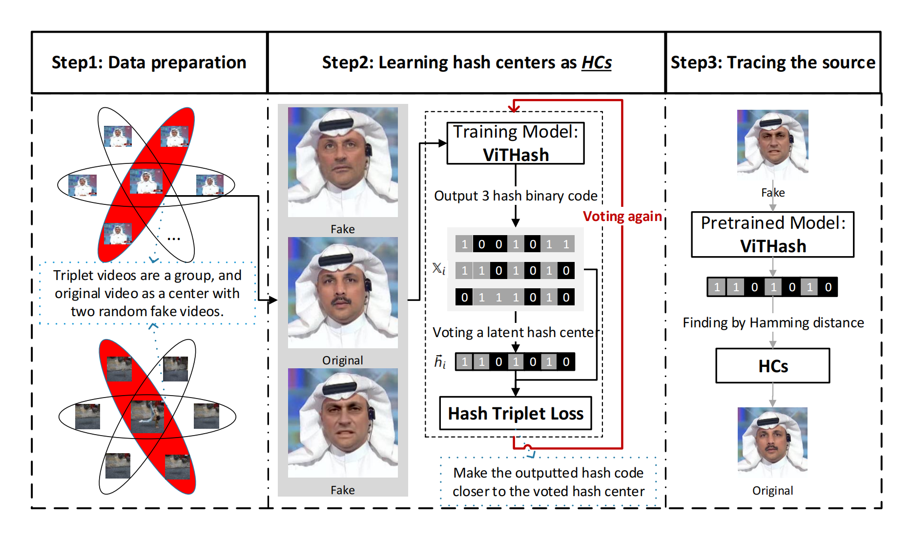

<h1 align="center">
Robust and Reliable Video Forgery Detection
</h1>

## 📜 Directory

- [Introduction](#-introduction)
- [ViTHash](#%EF%B8%8Fvithash)
- [Train or Test](#-train-or-test)
  - [Train](#train)
  - [Test](#test)
- [Downloads](#%EF%B8%8F-downloads)
  - [Download Models and Datasets](#download-models-and-datasets)
  - [DFS Dataset Samples](#dfs-dataset-samples)
  - [DAVIS-VI Dataset Samples](#davis-vi-dataset-samples)
  - [VideoSplicing Dataset Samples](#videosplicing-dataset-samples)

## ✨ Introduction

In recent years, fake videos have been widely spread on the Internet with social hot events. Forgery detection is an effective way to avoid causing greater losses. Conventional fake video detection methods output a possible value or a suspected regions. However, such non-interpretability results are not wholly convincing. Another alternative and more effective way is to find the original video with fake video. We propose a Vision Transformer based method called ViTHash. ViTHash is used to train Hash Centers, and the Hash Centers are used to trace the source of fake videos. Specifically, traditional video retrieval usually aims to find semantic-similar videos, likeness to find videos of the same classification. Compared with traditional video retrieval, it is a challenge to trace the unique original video from all original videos, especially when there are many similar videos. We designed a novel loss called Hash Triplet Loss, to solve those problems. In addition, we designed a tool named Localizator to compare the difference between the traced original video and the fake video. Above all, we do extensive experiments on datasets: FaceForensics++, Celeb-DF and DeepFakeDetection. Our experiments show that our performance is outstanding compared to the state-of-the-art methods, especially in cross-datasets mode. Furthermore, we have done reliability experiments on our built three datasets: DAVIS2016-TL, VSTL, and DFTL. The reliability experiments shown that ViTHash is effective in different domains: video inpainting, video splicing and similar scenes.

## 👀️ViTHash

<div align="center">
    
</div>

## 🔬 Train or Test

### Train

**Train ViTHash**

```apache
python train_h.py --local_rank=0 --path=../Celeb-DF --type=Celeb-DF --hash_bits=512 --pretrained=x
```

### Test

**Test ViTHash**

```apache
python test_h.py --local_rank=0 --path=../Celeb-DF --type=Celeb-DF --hash_bits=512 --pretrained=x
```

## 🚀️ Downloads

### Download Models and Datasets

**Pretrained models, hash centers and datasets**


| Item          | Link                                                                     | Comments                                                        |
| --------------- | -------------------------------------------------------------------------- | ----------------------------------------------------------------- |
| All Models    | [BaiduNetdisk](https://pan.baidu.com/s/1AXOs4HoDfLpUKiC6mkQl9g?pwd=i5l1) | code：i5l1                                                      |
| VideoSplicing | [BaiduNetdisk](https://pan.baidu.com/s/1Ng4BVAxV6t_HbtpZuQN3yg?pwd=a9in) | code: a9in                                                      |
| DFS           | [BaiduNetdisk](https://pan.baidu.com/s/1sK1CfBJy_qMvPOVJkW1mXA?pwd=eaj0) | code: eaj0                                                      |
| DAVIS-VI      | [BaiduNetdisk](https://pan.baidu.com/s/1h1fu-P-pac5akQpZGNItMw?pwd=ande) | code: ande Extension of[DAVIS2016](https://davischallenge.org/) |

### DFS Dataset Samples

> The person with different scenes.

<div style="align-items: center;text-align: center; display: inline-block" >
    <div>
        <h3 align="center">Source Videos</h3>
        <div  align="center">
            
            
            
        </div>
    </div>
    <div>
        <h3 align="center">Fake Videos</h3>
        <div  align="center">
            
            
            
        </div>
    </div>  
</div>

> Different fake videos are made from the same source.

<div style="align-items: center;text-align: center; display: inline-block" >
    <div>
        <h3 align="center">Source Video</h3>
        <div  align="center">
            
        </div>
    </div>
    <div>
        <h3 align="center">Fake Videos</h3>
        <div  align="center">
            
            
            
        </div>
    </div>  
</div>

### DAVIS-VI Dataset Samples

> The first gif of the boat is the original video, and the remaining five videos are generated by different object inpainting methods.

<div align="center" >
    <div>
        <div  align="center">
            
            
            
        </div>
    </div>
    <div>
        <div  align="center">
            
            
            
        </div>
    </div>  
</div>

### VideoSplicing Dataset Samples

> The bird, person, soldier and planes are all spliced by manual.

<div align="center" >
    <div>
        <div  align="center">
            
            
            
        </div>
    </div>
    <div>
        <div  align="center">
            
            
            
        </div>
    </div>  
</div>

### Tips

_We have developed an additional tool to compare the difference between real video and fake video. Please see [tool](./ComparisonTool.md)_
